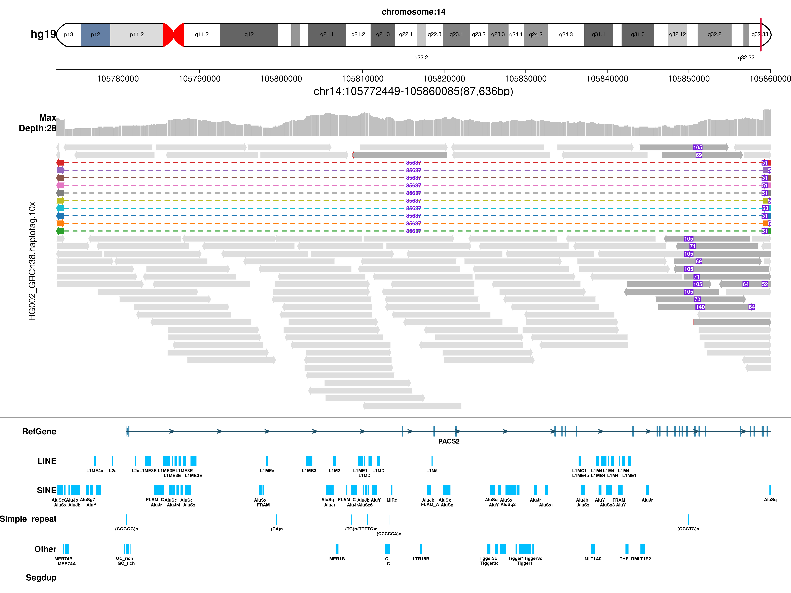
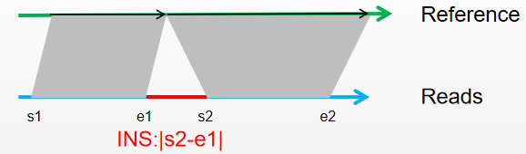
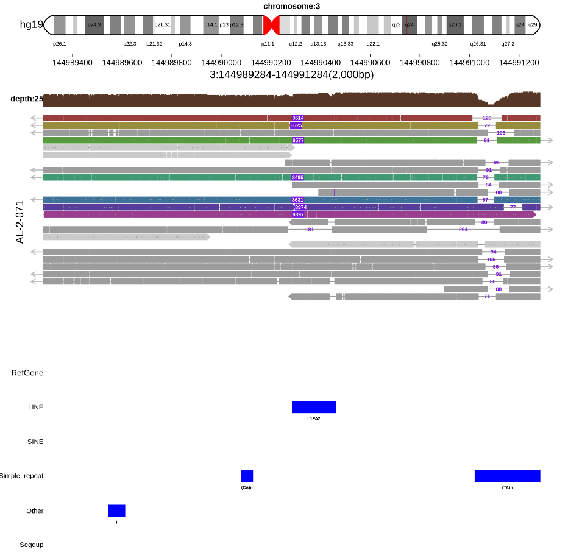
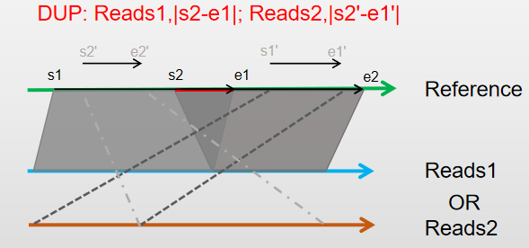
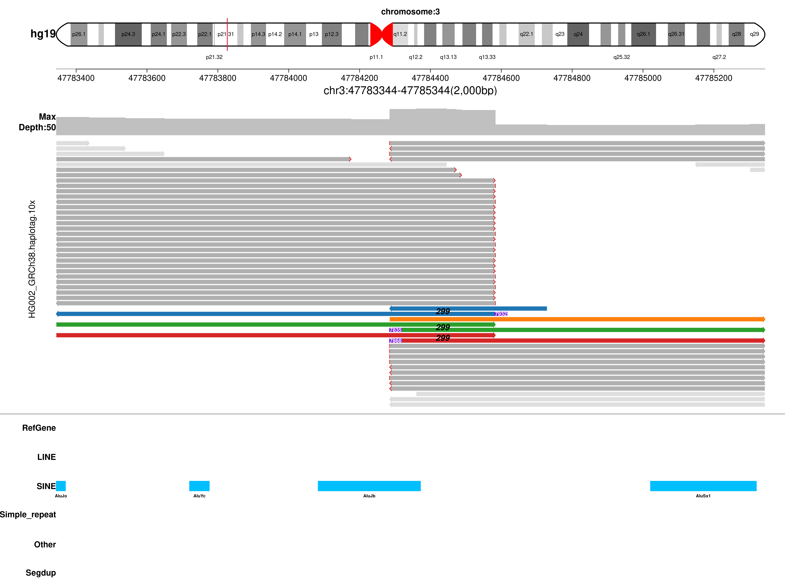
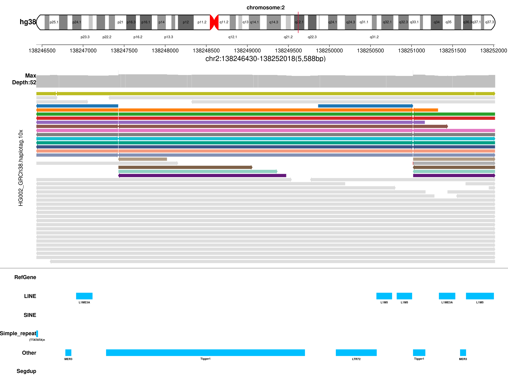
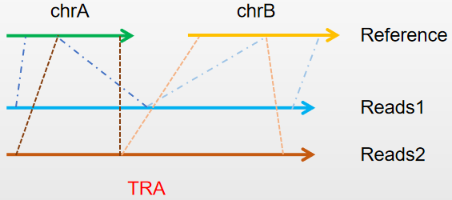
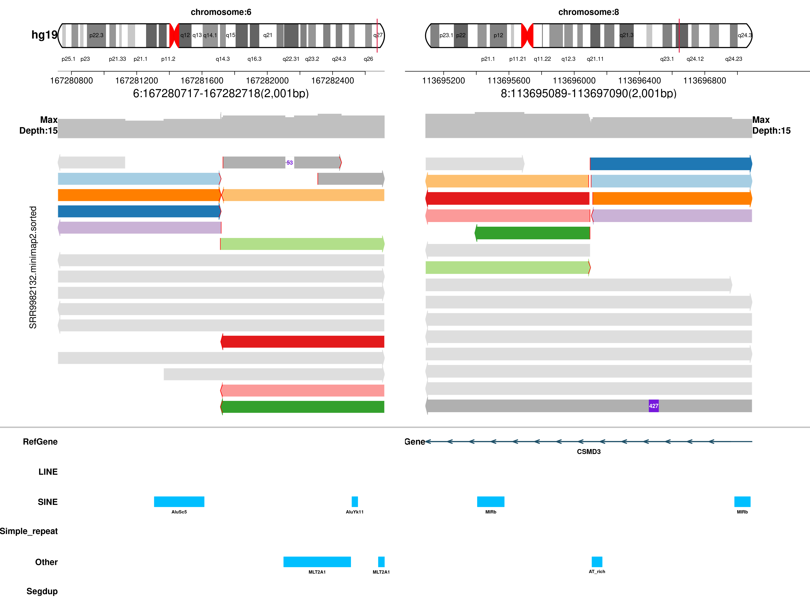

# SVhawkeye

SVhawkeye is a tool for verifying structural variation support and drawing quickly!

  - Detailed mapping and base information for each read in the interval
  - Drawing the Structural Graphics of Reads
  - Output genotype

# Authors:

  > Yuhui Xiao, Fan Liang

# contents
- [Installation](#installation)
- [Data Preparation](#data-preparation)
- [Structural Variation Description](#structural-variation-description)
- [Usage](#usage)
- [Example](#example)
- [Output](#output)
- [Contact](#contact)

# Installation
**[back to top](#contents)**
```sh
git clone git@github.com:yywan0913/SVhawkeye.git
cd SVhawkeye
chmod -R 755 SVhaweye.py
./SVhaweye.py --help
```
Depends：
python2
python package: pysam
R（any version）
R package: getopt

# Data Preparation 
**[back to top](#contents)**
- sample.bam(sample.bam.bai),support Multi-sample，comma-separated
- bed or vcf file
- ...

# Structural Variation Description
**[back to top](#contents)**
[] []
[] []
[] []
[] []
[] []
Split mapping were filled with color.

# Usage
**[back to top](#contents)**
optional arguments:
```
  -h, --help            show this help message and exit
  -i FILE, --bams FILE  set the input bam file. mark="," (default: None)
  -g hg19/hg38, --genome hg19/hg38
                        set reference,support:hg19/hg38 (default: hg19)
  -b FILE, --bedvcf FILE
                        set the input bed or vcf file. (default: None)
  -o Dir, --outdir Dir  set output dirname. (default: None)
  -t <type 'int'>, --thread <type 'int'>
                        Number of additional threads to use [0] (default: 0)
  -q num, --quanlty num
                        set reads mapping quanlty for filter,default:Q20
                        (default: 20)
  -d <type 'int'>, --extend <type 'int'>
                        set region extend length,if format==vcf,default:1000bp
                        (default: 1000)
  -f vcf/bed, --infmt vcf/bed
                        set input format:vcf or bed;default:bed (default: bed)
  -p True/False, --runpysam True/False
                        does run pysam for reads out? (default: True)
  -D True/False, --Drawpicture True/False
                        does draw IGV picture (default: True)
  -c True/False, --createvcf True/False
                        does create new vcf? recall sv (default: True)
  -fo png/pdf, --outfmt png/pdf
                        set out picture format,default:png (default: png)
```
# Example
if input bed,format:
|#chromosome|start|end|type|chromosome2|start2|end2|
|------|------|------|------|------|------|------|
|1|1288171|1290193|
|9|278819|279211|TRA|14|1427822|1429136|
```
SVhaweye.py -i father.bam,mather.bam,children.bam -g hg19 -b igv.bed -o test
```
if input vcf,format:
|#CHROM|POS|ID|REF|ALT|QUAL|FILTER|INFO|FORMAT|sample|
|------|------|------|------|------|------|------|------|------|------|
|5|17101355|sv549|N|<DEL>|.|pass|SVLEN=107;SVTYPE=DEL;END=17101462|GT|0/1|
```
SVhaweye.py -i tumor.bam,normal.bam -b test.vcf --format vcf -d 1000 -o test -g hg19
SVhaweye.py -i sample.bam -b test.vcf --format vcf -o test -g hg38 -q 20 -fo pdf
```

# Output
- tree
├── bedpysamout
│---└── AL.bam_3_144989284_144991284
├── figure
│---└── 3_144989284_144991284.png
├── input.bed
├── new.test.vcf
└── script
│---└── ARigvfrompysam.sh

- AL.bam_3_144989284_144991284 :

|RefStart|RefEnd|QueryStart|QueryEnd|ReadsLen|mapq|Strand|Color|Type|Reads|144989284|144989285|144989286|
|------|------|------|------|------|------|------|------|------|------|------|------|------|
|144990284|144992823|13214|15629|15660|60|-|1|INS--8614@@DEL_1787:120|1b90c763-669b-4eb7-a1c2-2cc9620f8c63|+|+|+|
|144985709|144990286|16|4599|15660|26|-|1|INS--8614|1b90c763-669b-4eb7-a1c2-2cc9620f8c63|A|T|C|
|144982187|144990271|16|7862|21878|43|-|2|INS--8625|22461e5b-f890-4c72-953a-d4548c985c6d|G|T|C|
|144990285|144995709|16488|21843|21878|57|-|2|INS--8625@@DEL_1787:72|22461e5b-f890-4c72-953a-d4548c985c6d|+|+|+|
|144971591|144998068|22|25544|25573|44|-|-1|DEL_1843:106|22bbd620-d020-4c4f-a3eb-d5d958b85bbc|A|T|C|
|144961923|144990286|29|28211|41972|49|+|3|INS--8577|25bd8913-f684-46aa-a4eb-f5c0209b3add|A|T|C|
|144990286|144995501|36789|41943|41972|51|+|3|INS--8577@@DEL_1786:81|25bd8913-f684-46aa-a4eb-f5c0209b3add|+|+|+|
|144977740|144990283|33|12331|16963|46|+|0|normal|2675e050-1c6a-424a-852d-72f28896eca1|A|T|C|

- new.test.vcf:
```
##FORMAT=<ID=GT,Number=1,Type=String,Description="Genotype">
##FORMAT=<ID=DA,Number=1,Type=Integer,Description="# number of high-quality reads(depth)">
##FORMAT=<ID=DV,Number=1,Type=Integer,Description="# number of high-quality variant reads">
##FORMAT=<ID=DO,Number=1,Type=Integer,Description="# number of high-quality other variant reads">
#CHROM	POS	ID	REF	ALT	QUAL	FILTER	INFO	FORMAT	AL-2-071
3	144990284	350963	N	<INS>	.	PASS	CHR2=3;END=144998771;SVTYPE=INS;RNAMES=1b90c763-669b-4eb7-a1c2-2cc9620f8c63,22461e5b-f890-4c72-953a-d4548c985c6d,25bd8913-f684-46aa-a4eb-f5c0209b3add,2fe5aaa3-8ed8-44a2-bc59-fc6d15ff9d61,42abc36e-8430-461d-b71e-a80858b9340a,7d95d851-2fe8-4187-baf6-4b71889a0ca9,7f9ecc76-8faf-4a57-a5bc-29b25dd17b12,85182445-ecd0-41fe-8ffd-346245d56568,9bd3aa48-9638-4a1d-8ae3-b6a71f4961b6;SVLEN=8487;RE=7;AF=0.28	GT:DV:DA:DO	0/1:7:25:0
```

# Contact
-------
If you have any questions, please contact the following folks:
Yuhui Xiao <xiaoyuhui@grandomics.com>

**[back to top](#contents)**
