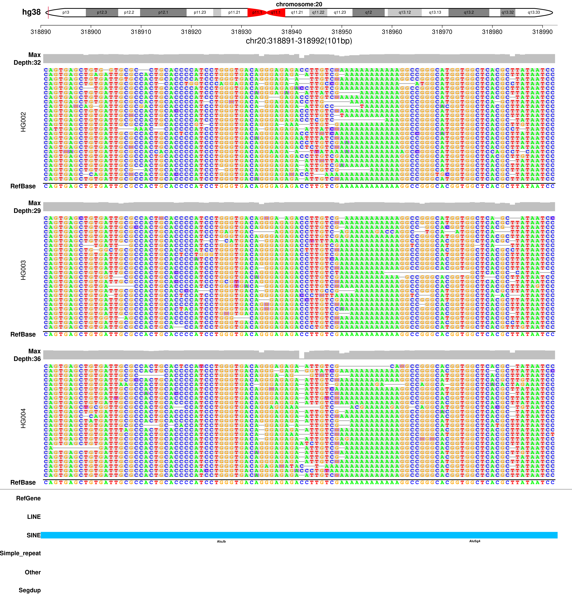
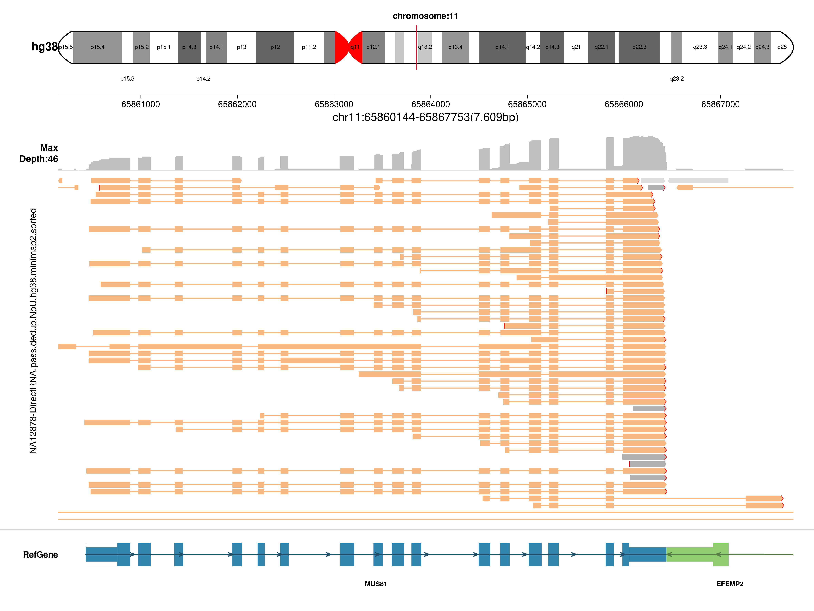

# SVhawkeye

SVhawkeye is a tool for verifying structural variation support and drawing quickly from bam files,
also, SVhawkeye can draw RNA structure from bam files on isoseq,
and SVhawkeye can draw SNP and indel structure and draw depth distribution by your range input.

  - Detailed mapping and base information for each read in the interval
  - Drawing the Structural Graphics of Reads
  - Output genotype
  
apply to bam files of longreads data, like ONT(Oxford Nanopore Technologies) or PacBio data.
Currently, it is not suitable for PE reads from NGS.

# support:

  - platorm data: ONT(Oxford Nanopore Technologies) or PacBio data, eg.
  - sequence data:  wgs,wes,isoseq,...

# function:

  - structure display: structural variation, SNP, INDEL, RNA, cnv-depth
  - sv genotyping

# Authors:

  > Yuhui Xiao, Fan Liang

# contents
- [Installation](#installation)
- [Data Preparation](#data-preparation)
- [Structural Variation Description](#structural-variation-description)
- [Usage](#usage)
- [Example](#example)
- [Output](#output)
- [Contact](#contact)

# Installation
**[back to top](#contents)**

```sh
git clone git@github.com:yywan0913/SVhawkeye.git
cd SVhawkeye
chmod -R 755 haweye.py
./haweye.py --help
```
Depends：

- python2 or python3

- python package: pysam

- R（any version）

- R package: getopt, data.table,RColorBrewer

# Data Preparation 
**[back to top](#contents)**
- sample.bam(sample.bam.bai),support Multi-sample，comma-separated,for example: -i A.bam,B.bam,C.bam,...
- bed or vcf file,for example:-b input.bed or -b input.vcf -f vcf
- maybe reference fasta , genePred file.  but not must.

# Structural Variation Description
**[back to top](#contents)**

<center>
  
**DEL:deletion**

</center>

- SV Judgment:


- show:


  
-------  

<center>
  
**INS：insertion**

</center>
  
- SV Judgment:


- show:


-------

<center>
  
**DUP:duplication**

</center>

- SV Judgment:


- show:


-------

<center>
  
**INV:inversion**

</center>
  
- SV Judgment:


- show:


-------

<center>
  
**TRA:translocation**

</center>

- SV Judgment:


- show:


Split mapping were filled with color.

-------
<center>

**RNA structure**

</center>
  
- RNA structure form isoseq:



-------

<center>

**trio structure**

</center>
  
- snp indel ... trio:




# Usage
**[back to top](#contents)**

optional arguments:
```
./hawkeye.py -h
commands:
    sv_browse             fast draw Structural variation or snp-inDel as IGV.
    snpindel_browse       fast draw snp or indel variation as IGV
    sv_genotyping         recall sv of existing input vcf file.
    rna_browse            display isoform structure from iso-seq
    regiondepth_browse    display depth distribution of your region
```

```
 ./hawkeye.py  sv_browse
  Options:
  -h, --help            show this help message and exit
  -i FILE, --bams=FILE  set the input bam file. mark=","; [required:True]
  -g GENOME, --genome=GENOME
                        set reference,support:hg19/hg38;while,other genome
                        also can draw but no annotation; [default:hg19]
  -b FILE, --bedvcf=FILE
                        set the input bed or vcf file; [required=True]
  -r FILE, --reffa=FILE
                        set the reference fasta file of inputbam, when
                        region<210bp and which can dispaly ref base;
                        [default:None]
  -o Dir, --outdir=Dir  set output dirname; [default: ./]
  -t <class 'int'>, --thread=<class 'int'>
                        Number of additional threads to use ; [default:0]
  -q num, --quanlty=num
                        set reads mapping quanlty for filter; [default: 20
                        (means Q20)]
  -I <class 'float'>, --identity=<class 'float'>
                        set min identity of mapping reads for filter;
                        [default: 0.6]
  -d <class 'int'>, --extend=<class 'int'>
                        set region extend length; [default:1000bp]
  -f vcf/bed, --infmt=vcf/bed
                        set input format:vcf or bed; [default:bed]
  -F png/pdf, --outfmt=png/pdf
                        set out picture format; [default:png]
  -l <class 'int'>, --sv_min_length=<class 'int'>
                        Minimum length of SV to be reported; [default:50]
```
# Example
**[back to top](#contents)**

if input bed,format:

|#chromosome|start|end|type|chromosome2|start2|end2|
|------|------|------|------|------|------|------|
|1|1288171|1290193|
|9|278819|279211|TRA|14|1427822|1429136|

```
haweye.py sv_browse -i father.bam,mather.bam,children.bam -g hg19 -b igv.bed -o testdir -t 3
```

if input vcf,format:

|#CHROM|POS|ID|REF|ALT|QUAL|FILTER|INFO|FORMAT|sample|
|------|------|------|------|------|------|------|------|------|------|
|5|17101355|sv549|N|<DEL>|.|pass|SVLEN=107;SVTYPE=DEL;END=17101462|GT|0/1|
```
SVhaweye.py -i tumor.bam,normal.bam -b test.vcf --format vcf -d 1000 -o test -g hg19
SVhaweye.py -i sample.bam -b test.vcf --format vcf -o test -g hg38 -q 20 -fo pdf
```

# Output
**[back to top](#contents)**

- tree

├── bedpysamout

│---└── HG002_GRCh38.haplotag.10x.bam_chr14_105772449_105860085

├── figure

│---└── chr14_105773449_105859085.e1000.png

├── input.bed

├── new.test.vcf

└── script

│---└── Rigvfrompysam.sh

- HG002_GRCh38.haplotag.10x.bam_chr14_105772449_105860085 :

|Chr|RefStart|RefEnd|QueryStart|QueryEnd|ReadsLen|Mapq|Identity|Strand|Color|Type|Readsorder|ReadsID|
|chr14|105761683|105773457|0|11754|11755|60|NA|+|0|normal|13|m64014_181210_152538/159122871/ccs|
|chr14|105761697|105772813|1|11103|11102|60|NA|-|0|normal|1|m64018_190129_193747/10749818/ccs|
|chr14|105765546|105773455|1407|9307|9306|60|NA|-|1|DEL--chr14_105773455-105859091:85637|10.01|m64020_190123_225958/110167169/ccs|
|chr14|105859091|105860456|1|1407|9306|60|NA|-|1|ins--chr14_105859685-105859686:51@@DEL--chr14_105773455-105859091:85637|10|m64020_190123_225958/110167169/ccs|
|chr14|105766543|105773455|0|6913|10691|60|NA|+|2|DEL--chr14_105773455-105859091:85637|11|m64014_181210_152538/174458956/ccs|

- new.test.vcf:

```
##FORMAT=<ID=GT,Number=1,Type=String,Description="Genotype">
##FORMAT=<ID=DA,Number=1,Type=Integer,Description="# number of high-quality reads(depth)">
##FORMAT=<ID=DV,Number=1,Type=Integer,Description="# number of high-quality variant reads">
##FORMAT=<ID=DO,Number=1,Type=Integer,Description="# number of high-quality other variant reads">
|#CHROM|POS|ID|REF|ALT|QUAL|FILTER|INFO|FORMAT|HG002_GRCh38.haplotag.10x|
|chr14|105773449|pbsv.DEL.38747|refseq|T|.|PASS|SVTYPE=DEL;END=105859085;SVLEN=-85636|GT:DV:DA:DO|0/1:10:35:0|
```

# Contact
-------
If you have any questions, please contact the following folks:

Yuhui Xiao <651874494@qq.com>

**[back to top](#contents)**
